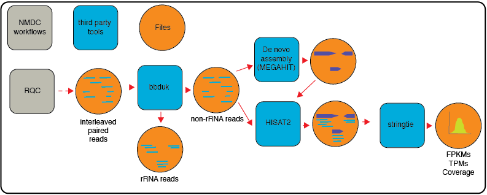

# metaT: The Metatranscriptome Workflow

## Summary
This workflow is designed to analyze metatranscriptomes.



## Version
0.0.3

## Third party tools and packages
To run this workflow you will need a Docker (Docker ≥ v2.1.0.3) instance and cromwell. All the third party tools are pulled from Dockerhub.

```
cromwell ≥ 54
bbduk ≥ v38.44
hisat2 ≥ 2.1
Python ≥ v3.7.6
featureCounts ≥ v2.0.1
R ≥ v3.6.0
edgeR ≥ v3.28.1 (R package)
pandas ≥ v1.0.5 (python package)
gffutils ≥ v0.10.1 (python package)

```

## Databases
metaT uses the same database uses for metagenome annotation. See README [here](https://github.com/microbiomedata/mg_annotation) for required databases.For QC databases see [here](https://github.com/microbiomedata/ReadsQC.)


## Running workflow

###  In a server with shifter
The submit script will request a node and launch the Cromwell.  The Cromwell manages the workflow by using Shifter to run applications.


```
java -Dconfig.file=wdls/shifter.conf -jar /full/path/to/cromwell-XX.jar run -i input.json /full/path/to/wdls/metaT.wdl

```
<!-- ```
   java  -jar /path/to/cromwell-XX.jar run wdls/metaT_part1.wdl -i  test_data/small_test/test_small_input.json -m metadata_out_part1.json
   java  -jar /path/to/cromwell-XX.jar run wdls/metaT_part2.wdl -i  test_data/small_test/test_small_input.json -m metadata_out_part2.json 
``` -->

<!-- java -jar cromwell/cromwell-48.jar run wdls/nmdc-metaT_full.wdl -i test_data/small_test/test_small_input_fullpipe.json -l test_data/small_test/test_small_input_label.json -->


## Docker images

- `microbiomedata/meta_t:latest`. 
`Dockerfile` can be found in `Docker/metatranscriptomics/` directory. 
- `intelliseqngs/hisat2:1.2.1`
- `microbiomedata/bbtools:38.90`
- `scanon/nmdc-meta:v0.0.1`

## Inputs

```json
{
    "nmdc_metat.proj": "gold:Ga0370541",
    "nmdc_metat.input_file": "/global/cfs/cdirs/m3408/aim2/metatranscriptomics/metaT/test_data/small_test/test_smaller_interleave.fastq.gz",
    "nmdc_metat.git_url": "https://github.com/microbiomedata/mg_annotation/releases/tag/0.1",
    "nmdc_metat.url_base": "https: //data.microbiomedata.org/data/",
    "nmdc_metat.outdir": "/global/cfs/cdirs/m3408/aim2/metatranscriptomics/metaT/test_data/test_small_out",
    "nmdc_metat.resource": "NERSC - Cori",
    "nmdc_metat.url_root": "https://data.microbiomedata.org/data/",
    "nmdc_metat.rqc_database": "/global/cfs/cdirs/m3408/aim2/database/",
    "nmdc_metat.annot_database": "/global/cfs/cdirs/m3408/aim2/database/img/",
    "nmdc_metat.activity_id": "test-activity-id"
}
```
### Input option descriptions:
**proj**: A unique name for your project or sample.
**input_file**: Full path to the fastq file. The file must be intereleaved paired end fastq.
**git_url**: A link to this version. Update it based on which version you downloaded.
**url_base**: A web location where all the data objects from this run will be stored.
**url_root**: Same as url_base.
**outdir**: Full path of the folder where all the important outputs will be saved.
**resource**: A short description or name of where the data was processed.
**rqc_database**: Full path to the folder where the RQC database is. RQC database folder must have `RQCFilterData` as its name.
**annot_database**: Full path to annotation database. Within this folder, it must have number of other folders. See `mg_annotation` repo for more details.
**activity_id**: A unique ID for the project.


## Outputs
All outputs can be found in the `outdir` folder. There are following subfolders:
`annotation`: contains gff files from annotation run.
`assembly`: contains FASTA fils from assembly.
`mapback`: BAM file where reads were mapped back to the contigs.
`metat_output`: A JSON file that has records for feature, their annotations, read counts from featurecount, and FPKM values. 
`qa`: contains cleaned reads and a file with associated statistics.

# Output JSON
The output file is a JSON formatted file called `out.json` with JSON records that contains RPKMs, reads, and information from annotation. An example JSON record:
```json
        {
            "read_count": 5,
            "rpkm": 4.642,
            "featuretype": "CDS",
            "seqid": "seqid_8_10",
            "id": "seq_327",
            "source": "GeneMark.hmm_2 v1.05",
            "start": 10,
            "end": 327,
            "length": 318,
            "strand": "+",
            "frame": "0",
            "extra": [],
            "cog": "COG0208",
            "ko": "KO:K00526",
            "ec_number": "EC:1.17.4.1",
            "product": "ribonucleoside_diphosphate reductase beta chain"
        }

```

## Test 
To test the workflow, we have provided a small test dataset and a step by step guidance below:

### Step 1:

- Download the latest version of the metaT workflow.

```

git clone https://github.com/microbiomedata/metaT.git

```

- Change the branch of the repo from `main` to `full_wdl_v1`

 ```
git checkout full_wdl_v1

 ```

### Step 2

Create or edit an input.json file using `test_data/test_small_input_fullpipe.json` as a template.

- `cd` into the metaT folder and then run the following command. You must have shifter and cromwell downloaded and installed.

```
cd metaT

java -Dconfig.file=wdls/shifter.conf -jar /full/path/to/cromwell-XX.jar run -i /full/path/to/metaT/test_data/test_small_input_fullpipe.json /full/path/to/metaT/wdls/metaT.wdl
```
<!-- #TODO add documentation, get stuff from BIN -->