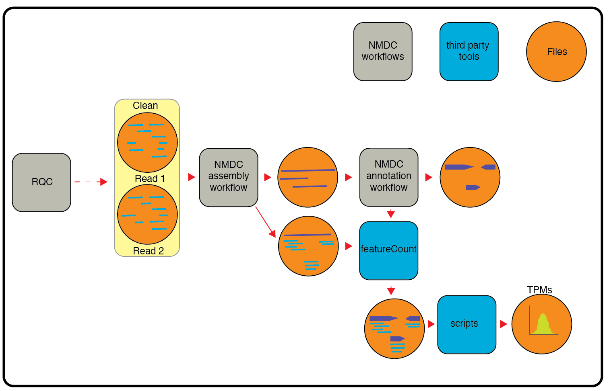

# metaT: The Metatranscriptome Workflow
## Summary
This workflow analyzes metatranscriptomes. It takes contigs and BAM file from [metaAssembly](https://github.com/microbiomedata/metaAssembly) and gff file from [mg_annotation](https://github.com/microbiomedata/mg_annotation) as inputs. It outputs multiple JSON files, one for each feature in the gff file.


## Third party tools and packages
```
featureCounts v2.0.0
R v3.5.1
edgeR v3.24.3(an R package)
Python v3.7.6
pandas v1.0.5 (python package)
gffutils v0.10.1 (python package)
```


## Running workflow

<!-- ````
salloc -N 1 -C haswell -q interactive -t 04:00:00

/global/cfs/cdirs/m3408/ficus/pipeline_products

``` -->
### In local computer/server with third party tools installed and in PATH.
Running workflow in a local computer or server where all the dependencies are installed and in path. cromwell should be installed in the same directory as this file. 

`cd` into the folder and:

```
	$ java -jar /path/to/cromwell-XX.jar run workflows/metaT.wdl -i test_data/test_input.json -m metadata_out.json

```

### In a local computer/server with docker
Running workflow in a local computer or server using docker. cromwell should be installed in the same directory as this file.

```
   java  -jar /path/to/cromwell-XX.jar run workflows/dock_metaT.wdl -i  test_data/test_input.json -m metadata_out.json 
```

###  In cori with shifter 

Running workflow in cori with JTM:

The submit script will request a node and launch the Cromwell.  The Cromwell manages the workflow by using Shifter to run applications.

```
java -Dconfig.file=workflows/shifter.conf -jar /path/to/cromwell-XX.jar run -m metadata_out.json -i test_data/test_input_cori.json workflows/dock_metaT.wdl

```
### In cori with shifter and JTM

```
java -Dconfig.file=jtm.conf -jar cromwell-XX.jar run -i test_data/test_input.json workflows/shift_metaT.wdl
```

## Docker image

The docker images for all profilers is at the docker hub: `microbiomedata/meta_t:latest`. The `Dockerfile` can be found in `Docker/metatranscriptomics/` directory.


## Inputs
fasta: contigs file from assembly workflow
gff: annotation file from annotation workflow
bam file: BAM file produced by mapping reads back to the contigs (also from assembly workflow)
json: json file with paths to input and additional information (see below)

```json
{
  "metat_omics.project_name": "1781_100346",
  "metat_omics.no_of_cpu": 1,
  "metat_omics.contig_file_path": "/path/to/assembly_contigs.fna",
  "metat_omics.gff_file_path": "/path/to/annotation_test.gff",
  "metat_omics.bam_file_path": "/path/to/pairedMapped_sorted.bam"
}

```
## Outputs
The output files are a set of JSON formatted file such as `CDS.json`, `rRNA.json`, etc. that contains raw read counts, rpkms, and additional annotation metadata from gff file. File names are based on the feature (third column of a gff file) listed in gff files. An example JSON record:

```json
{
    "read_count": 5,
    "rpkm": 9780.908,
    "featuretype": "CDS",
    "seqid": "1781_100346_scf_10009_c1",
    "id": "1781_100346_scf_10009_c1_3_452",
    "source": "GeneMark.hmm_2 v1.05",
    "start": 3,
    "end": 452,
    "length": 450,
    "strand": "_",
    "frame": "0",
    "extra": [],
    "cog": "COG0568",
    "ko": "KO:K03086",
    "pfam": "Sigma70_r",
    "product": "RNA polymerase primary sigma factor"
}

```

<!-- #TODO add documentation, get stuff from BIN -->