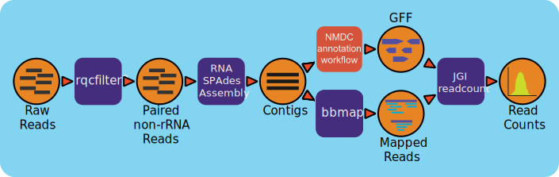

:github_url: https://github.com/microbiomedata/metaT/blob/main/docs/index.rst

..
   Note: The above `github_url` field is used to force the target of the "Edit on GitHub" link
         to be the specified URL. That makes it so the link will work, regardless of the Sphinx
         site the file is incorporated into. You can learn more about the `github_url` field at:
         https://sphinx-rtd-theme.readthedocs.io/en/stable/configuring.html#confval-github_url

Metatranscriptome Workflow (v0.0.6)
=====================================

Workflow Overview
-----------------
MetaT is a workflow designed to analyze metatranscriptomes, building on top of already existing NMDC workflows for processing input. The metatranscriptoimics workflow takes in raw data and starts by quality filtering the reads using the `MetaT RQC workflow <https://github.com/microbiomedata/metaT_ReadsQC>`_. With filtered reads, the workflow filters out rRNA reads (and separates the interleaved file into separate files for the pairs) using bbduk (BBTools). After the filtering steps, reads are assembled into transcripts using the `MetaT Assembly workflow <https://github.com/microbiomedata/metaT_Assembly>`_ and annotated using the `Metagenome Anotation workflow <https://github.com/microbiomedata/mg_annotation>`_; producing GFF funtional annotation files. Features are counted with `MetaT Read Counting workflow <https://github.com/microbiomedata/metaT_ReadCounts>`_ which assigns mapped reads to genomic features for sense and antisense reads. Please refer to each repository for their detailed documentation. 

Workflow Availability
---------------------
The workflow uses the listed docker images to run all third-party tools.
The workflow is available in GitHub: 
https://github.com/microbiomedata/metaT; and the corresponding Docker images that have all the required dependencies are available in following DockerHub:   

- `microbiomedata/meta_t:0.0.5 <https://hub.docker.com/r/microbiomedata/meta_t>`_
- `bryce911/bbtools:38.86 <https://hub.docker.com/r/microbiomedata/bbtools>`_

Requirements for Execution (recommendations are in bold):  
--------------------------------------------------------
#. WDL-capable Workflow Execution Tool (**Cromwell**)
#. Container Runtime that can load Docker images (**Docker v2.1.0.3 or higher**)

Workflow Dependencies
---------------------
Third-party software (These are included in the Docker images.)
~~~~~~~~~~~~~~~~~~~~~~~~~~~~~~~~~~~~~~~~~~~~~~~~~~~~~~~~~~~~~~~~
#. `BBTools v38.94 <https://jgi.doe.gov/data-and-tools/bbtools/>`_. (License: `BSD-3-Clause-LBNL <https://bitbucket.org/berkeleylab/jgi-bbtools/src/master/license.txt>`_.)
#. `Python v3.7.12 <https://www.python.org/>`_.  (License: Python Software Foundation License)
#. `pandas v1.0.5 <https://pandas.pydata.org/>`_. (python package) (License: BSD-3-Clause)
#. `gffutils v0.10.1 <https://daler.github.io/gffutils/>`_. (python package) (License: MIT)

Requisite database
~~~~~~~~~~~~~~~~~~
The RQCFilterData Database must be downloaded and installed. This is a 106 GB tar file which includes reference datasets of artifacts, adapters, contaminants, the phiX genome, rRNA kmers, and some host genomes.  The following commands will download the database: 

.. code-block:: bash

  wget http://portal.nersc.gov/dna/microbial/assembly/bushnell/RQCFilterData.tar
  tar -xvf RQCFilterData.tar
  rm RQCFilterData.tar	

Sample datasets
---------------

- Processed Metatranscriptome of soil microbial communities from the East River watershed near Crested Butte, Colorado, United States - ER_RNA_119 (`SRR11678315 <https://www.ncbi.nlm.nih.gov/sra/SRX8239222>`_) with `metadata available in the NMDC Data Portal <https://data.microbiomedata.org/details/study/nmdc:sty-11-dcqce727>`_. 

  - The zipped raw fastq file is available `here <https://portal.nersc.gov/cfs/m3408/test_data/metaT/SRR11678315.fastq.gz>`_
  - The sample outputs are available `here <https://portal.nersc.gov/cfs/m3408/test_data/metaT/SRR11678315/>`_

- A larger dataset from the same study: `SRR11678313 <https://www.ncbi.nlm.nih.gov/sra/SRX8239220>`_

  - The zipped raw fastq file is available `here <https://portal.nersc.gov/cfs/m3408/test_data/metaT/SRR11678313.fastq.gz>`_

Input: 
~~~~~~~~~~~~~~~~~~~~
A JSON file containing the following
#.	output file prefix
#.  path to :code:`input_file` if interleaved file
#.  paths to :code:`input_fq1` and :code:`input_fq2` non-interleaved paired-end reads 
#.	input_interleaved (boolean)
#.	RNA strand type (optional) either left blank, :code:`aRNA`, or :code:`non_stranded_RNA`

For further customization (such as databases and licenses outside of the NERSC / JAWS system), please refer to the individual repositories and add input parameters to metaT.wdl. Here is an example for adding the MetaT ReadsQC database:

- Add to input{:code:`String rqc_db`}
- Add to call readsqc.metaTReadsQC as qc {input: :code:`database = rqc_db`}
- Add to input.json {:code:`"nmdc_metat.rqc_db": "/your_refdata/"`}

An example JSON file is shown below:

.. code-block:: JSON

  {
      "nmdc_metat.input_file": "https://portal.nersc.gov/project/m3408//test_data/metaT/SRR11678315.fastq.gz",
      "nmdc_metat.project_id":"SRR11678315-int-0.1",
      "nmdc_metat.input_interleaved": true
  }

Output
~~~~~~
Outputs are split up between steps of the workflow. The first half of the workflow will output rRNA-filtered reads and the assembled transcripts. After annotations and featureCount steps include a JSON file that contain read counts for both sense and antisense, reads, and information from annotation for each feature. This is the first block from the top 100 features output json:

.. code-block:: JSON

 {
        "featuretype":"CDS",
        "seqid":"SRR11678315-int-0.1_02468",
        "id":"SRR11678315-int-0.1_02468_2_823",
        "source":"Prodigal v2.6.3_patched",
        "start":2,
        "end":823,
        "length":822,
        "strand":"-",
        "frame":"0",
        "product":"cation transport ATPase",
        "product_source":"COG2217",
        "sense_read_count":3142,
        "mean":1563.9,
        "median":1458.0,
        "stdev":617.57,
        "antisense_read_count":3064,
        "meanA":1506.08,
        "medianA":1408.0,
        "stdevA":599.53
    }

Below is an example of the output directory files with descriptions to the right.

.. list-table:: 
   :header-rows: 1

   * - Directory/File Name
     - Description

   * - readsQC/filtered.fastq.gz
     - non-ribosomal reads 
   * - readsQC/filterStats.txt
     - summary statistics in JSON format
   * - readsQC/filterStats2.txt
     - more detailed summary statistics
   * - readsQC/rRNA.fastq.gz
     - ribosomal reads  
   * - readsQC/rqc.info
     - workflow information 
   * - readsQC/qc_stats.json
     - summary statistics in json form

   * - assembly/contigs.fna
     - assembled contigs
   * - assembly/scaffolds.fna
     - assembled scaffolds
   * - assembly/readlen.txt
     - read length information
   * - assembly/bamfiles.tar
     - zipped collection of bam files 
   * - assembly/pairedMapped.sam.gz
     - alignment of reads and transcripts
   * - assembly/pairedMapped.bam
     - binary alignment of reads and transcripts
   * - assembly/pairedMapped_sorted.bam.bai
     - bam index file 
   * - assembly/pairedMapped_sorted.bam.cov
     - bam coverage file 
   * - assembly/scaffold_stats.json
     - scaffold coverage statistics
   * - assembly/assy.info
     - assembly workflow information 
   * - assembly/spades.log
     - spades run log 

   * - annotation/prefix_cath_funfam.gff
     - gff functional annotation generated from Cath-FunFam (Functional Families) database
   * - annotation/prefix_cog.gff
     - gff functional annotation generated from COG (Clusters of Orthologous Groups) database
   * - annotation/prefix_contig_names_mapping.tsv
     - tsv mapping assembly scaffold IDs to contig annotation IDs (to be uniform)
   * - annotation/prefix_contigs.fna
     - fasta with contigs renamed to annotation IDs
   * - annotation/prefix_crt.crisprs
     - xml file with CRISPR terms
   * - annotation/prefix_crt.gff
     - gff structural annotation generated with CRT
   * - annotation/prefix_ec.tsv
     - tsv file for EC annotation
   * - annotation/prefix_functional_annotation.gff
     - gff with functional annotations
   * - annotation/prefix_genemark.gff
     - gff with structural annotation by GeneMark
   * - annotation/prefix_gene_phylogeny.tsv
     - tsv of gene phylogeny
   * - annotation/prefix_imgap.info
     - workflow information
   * - annotation/prefix_ko_ec.gff
     - gff annotation with KO and EC terms
   * - annotation/prefix_ko.tsv
     - tsv of only KO terms
   * - annotation/prefix_pfam.gff
     - gff functional annotation from Pfam database
   * - annotation/prefix_prodigal.gff
     - gff structural annotation by Prodigal
   * - annotation/prefix_product_names.tsv
     - tsv of annotation products
   * - annotation/prefix_proteins.faa
     - fasta of protein sequences
   * - annotation/prefix_rfam.gff
     - gff structural annotation by RFAM
   * - annotation/prefix_scaffold_lineage.tsv
     - tsv of phylogeny at scaffold level
   * - annotation/prefix_smart.gff
     - gff functional annotation from SMART database
   * - annotation/prefix_stats.json
     - json of annotation statistics report
   * - annotation/prefix_stats.tsv
     - tsv of annotation statistics report
   * - annotation/prefix_structural_annotation.gff
     - gff structural annotation
   * - annotation/prefix_supfam.gff
     - gff functional annotation from SUPERFAMILY database
   * - annotation/prefix_tigrfam.gff
     - gff functional annotation from TIGRFAM database
   * - annotation/prefix_trna.gff
     - gff structural annotation by tRNAscan-SE

   * - readmap/rnaseq_gea.txt
     - read counts table 
   * - readmap/readcount.stats.log
     - read count statistics 
   * - readmap/readcount.info
     - read count workflow info
   * - readmap/paired.gff.json
     - renamed gff converted to json
   * - readmap/paired.rc.json
     - read count file renamed to json
   * - readmap/gff_rc.json
     - combination of gff and read count files
   * - readmap/cds_counts.json
     - cds only counts
   * - readmap/sense_counts.json
     - sense strand only counts
   * - readmap/antisense_counts.json
     - antisense strand only counts
   * - readmap/top100_features.json
     - top 100 feature counts 
   * - readmap/sorted_features.json
     - feature counts sorted from most to least
   * - readmap/sorted_features.tsv
     - tsv format of sorted feature counts 

For just the final readmap jsons, they are not included in the MetaT Read Counts repository, but added as an additional task in the MetaT wrapper script. To generate the jsons, run the following in a new WDL file:

.. code-block::

      import "./metat_tasks.wdl" as tasks
      input {
           # input relevate tasks for the files below
       }
         call tasks.rctojson as tj{
           input:
           readcount = rc.count_table, # this is taken straight from wrapper, so change as needed
           gff = anno.functional_gff,
           prefix = prefix,
           container = tj_container
       }

Version History 
---------------
- 0.0.2 (release date 01/14/2021; previous versions: 0.0.1)
- 0.0.3 (release date 07/28/2021; previous versions: 0.0.2)
- 0.0.4 (release date 08/31/2021; previous versions: 0.0.3)
- 0.0.5 (release date 10/28/2021; previous versions: 0.0.4)
- 0.0.6 (release date 09/17/2024; previous versions: 0.0.5)
- 0.0.7 (release date 09/19/2024; previous versions: 0.0.6)

Points of contact
-----------------
- Author: Migun Shakya <migun@lanl.gov>
- Maintainer: Kaitlyn Li <kli@lanl.gov>

